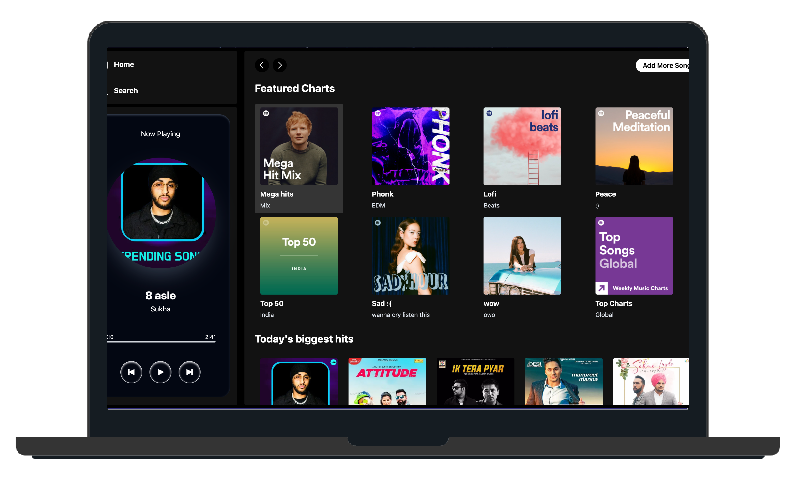

<h2 align="center">
  JusMusic🎶<br/>
  <a target="_blank" href="https://rahul-jassal-jusmusic.vercel.app/" target="_blank">Live app</a>
</h2>
<div align="center">
  
</div>

<br/>
<center>

[](https://forthebadge.com) &nbsp;
[](https://forthebadge.com) &nbsp;
[](https://forthebadge.com)

</center>

<p>
  <b>JusMusic</b> is a dynamic music streaming platform built with a modern tech stack, including React, Tailwind CSS, Node.js, Express, and MongoDB. Users can discover and stream their favorite tunes, while administrators enjoy the flexibility of adding new songs and albums through a dedicated admin app.
</p>

## API Reference

#### Get all songs

```http
  GET /api/song/lists
```

| Parameter | Type |
| :-------- | :--- |
| `NA`      | `NA` |

#### Get all albums

```http
  GET /api/album/lists
```

| Parameter | Type |
| :-------- | :--- |
| `NA`      | `NA` |

## How to Setup

#### Frontend Setup

To Setup this project on your system, first come into Spotify-clone Folder and trigger

##### install node modules

```bash
  cd spotify-clone
  npm i
```

##### run the FE

```bash
  npm run dev
```

#### Admin Setup

To setup admin frontend go to Spotify-admin Folder and trigger

##### install node modules

```bash
  cd spotify-admin
  npm i
```

##### run the Admin-FE

```bash
  npm run dev
```

#### Backend Setup

To Setup this project on your system, first come into spotify-backend Folder and trigger

##### Install packages

```bash
  cd spotify-backend
  npm i
```

##### create a .env file

##### Add MONGODB_URI of mongoDB

##### Add CLOUDINARY_NAME,CLOUDINARY_API_KEY and CLOUDINARY_SECRET_KEY of CLOUDINARY account ( if you don't have create one)

##### Run npm run server

```bash
  npm run server
```

## Tech Stack

**Client:** React, Tailwind and Axios

**Server:** NodeJS and Express

**Database:** mongoDB
